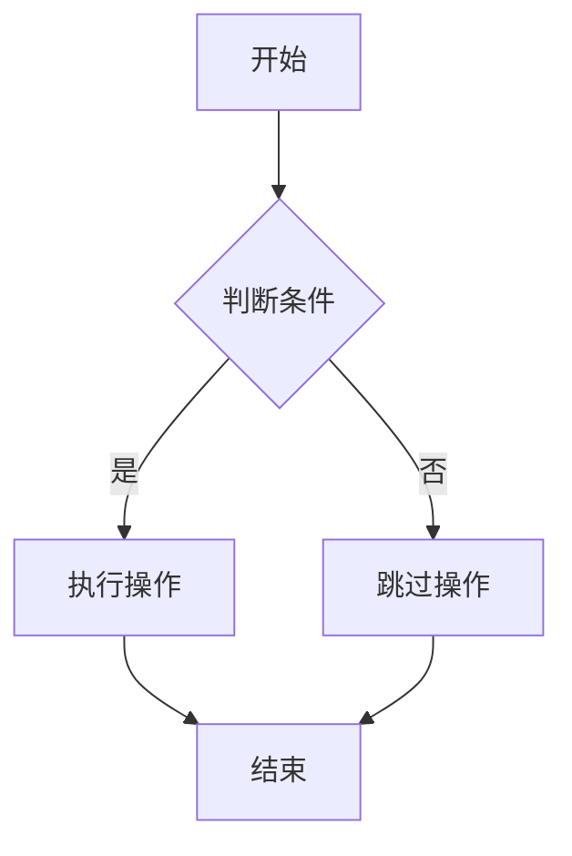
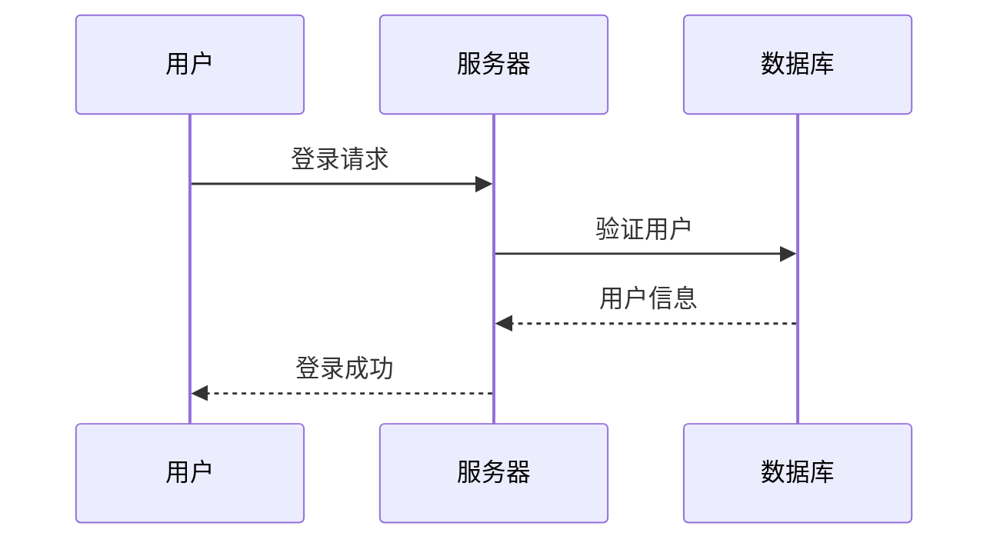
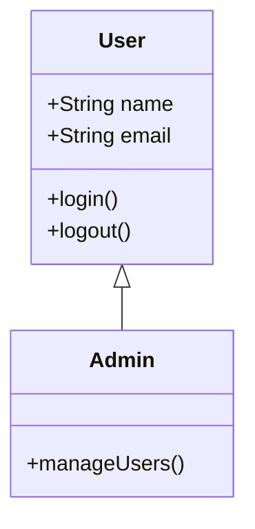

# Mermaid Copilot

🎨 现代化的 AI 驱动 Mermaid 图表编辑器，具备实时预览、智能聊天和多格式导出功能

[](https://opensource.org/licenses/MIT)
[](https://nodejs.org/)
[](https://vitejs.dev/)

## ✨ 核心特性

### 🤖 AI 智能助手
- **多平台 AI 集成** - 支持 OpenAI GPT-4、Claude、Gemini、通义千问、豆包等主流 AI 服务
- **GitHub Copilot 风格聊天** - 侧边栏实时对话，智能理解需求并生成图表
- **智能代码生成** - 根据自然语言描述自动生成 Mermaid 代码
- **上下文感知** - AI 能理解当前编辑器内容，提供精准的修改建议
- **代码快照功能** - 保存每次 AI 生成的代码版本，支持一键回滚

### 🎯 专业编辑体验
- **Monaco Editor 集成** - VS Code 同款编辑器，支持语法高亮、自动补全
- **实时预览** - 边编辑边预览，所见即所得的编辑体验
- **智能渲染优化** - AI 编写过程中的防闪烁技术，流畅的视觉体验
- **可调节布局** - 支持拖拽调整编辑器和预览区域大小
- **键盘快捷键** - 丰富的快捷键支持，提升编辑效率

### 📊 丰富的图表支持
- **流程图 (Flowchart)** - 基础到高级流程图，支持子图、多种节点形状
- **序列图 (Sequence)** - 用户交互、API 调用等时序流程
- **类图 (Class)** - 面向对象设计，继承关系可视化
- **状态图 (State)** - 状态机、业务流程状态转换
- **ER图 (Entity Relationship)** - 数据库设计和实体关系
- **甘特图 (Gantt)** - 项目管理、开发计划时间线
- **饼图 (Pie)** - 数据分布、统计分析
- **时间线 (Timeline)** - 发展历程、项目里程碑
- **Git图 (Git Graph)** - 分支管理、版本控制流程
- **用户旅程图 (Journey)** - 用户体验流程分析
- **思维导图 (Mindmap)** - 知识结构、项目规划
- **XY图表 (XY Chart)** - 数据趋势、性能监控
- **象限图 (Quadrant)** - 优先级分析、技能评估

### 🎨 主题与定制
- **多主题支持** - 默认、深色、森林、中性、基础主题
- **背景定制** - 白色、透明、黑色、灰色、蓝色背景，支持自定义颜色
- **缩放控制** - 图表放大缩小，最佳观看体验
- **全屏模式** - 沉浸式预览，支持真实全屏和 ESC 退出

### 📤 强大的导出功能
- **图片格式** - 高质量 PNG、矢量 SVG 导出
- **文档格式** - PDF、HTML、Markdown、XML 多格式支持
- **剪贴板操作** - 一键复制 SVG、图片、Office 兼容格式
- **Mermaid 代码** - 直接复制代码到其他平台使用

### 💾 数据管理
- **自动保存** - 实时保存编辑内容，防止数据丢失
- **历史记录** - 保存最近 50 次编辑历史
- **模板库** - 丰富的预置模板，覆盖各种使用场景
- **恢复功能** - 24 小时内自动恢复未保存内容

## 🚀 快速开始

### 环境要求

- Node.js >= 16.0.0
- npm 或 yarn

### 安装

```bash
# 克隆项目
git clone https://github.com/your-username/mermaid-copilot.git

# 进入项目目录
cd mermaid-copilot

# 安装依赖
npm install
```

### 开发

```bash
# 启动开发服务器
npm run dev

# 自动打开 http://localhost:3001
```

### 构建

```bash
# 构建生产版本
npm run build

# 预览构建结果
npm run preview
```

## 🛠️ 技术架构

### 前端技术栈
- **构建工具**: Vite 5.0+ (极速开发和构建)
- **图表引擎**: Mermaid v10.6.1 (最新版本，支持所有图表类型)
- **代码编辑器**: Monaco Editor v0.44.0 (VS Code 核心)
- **UI 框架**: Vanilla JavaScript (轻量化，无框架依赖)

### 核心依赖
- **图像处理**: html2canvas v1.4.1 (高质量图片导出)
- **PDF 生成**: jsPDF v2.5.1 (专业 PDF 输出)
- **SVG 转换**: canvas2svg v1.0.1 (矢量图形处理)

### AI 集成
- **多平台支持**: 统一 API 接口，支持所有主流 AI 服务
- **智能上下文**: 基于当前编辑器内容的上下文感知对话
- **流式输入**: 模拟真实编程体验的代码生成动画

## 📂 项目结构

```
mermaid-copilot/
├── public/                 # 静态资源
│   └── favicon.svg         # 应用图标
├── src/                    # 源代码
│   └── main.js            # 主入口文件 (3300+ 行)
│       ├── 编辑器初始化     # Monaco Editor 配置
│       ├── 图表渲染引擎     # Mermaid 渲染逻辑
│       ├── AI 聊天系统     # 智能对话和代码生成
│       ├── 导出功能模块     # 多格式导出处理
│       ├── 主题管理系统     # 主题和背景切换
│       ├── 数据持久化      # 自动保存和历史记录
│       └── 交互控制        # 用户界面交互逻辑
├── index.html             # 主页面 (1700+ 行)
│   ├── 响应式布局          # 现代化 UI 设计
│   ├── 侧边栏聊天界面      # GitHub Copilot 风格
│   ├── 工具栏和控制面板    # 丰富的功能按钮
│   ├── 分割可调节面板      # 编辑器和预览区域
│   └── 多个对话框组件      # AI 配置和生成界面
├── package.json           # 项目配置和依赖
├── vite.config.js         # Vite 构建配置
└── README.md              # 项目文档
```

## 🎯 使用指南

### 基础使用

1. **选择模板**: 从左侧模板库选择预设图表
2. **编辑代码**: 在 Monaco Editor 中编写或修改 Mermaid 代码
3. **实时预览**: 右侧面板实时显示图表渲染结果
4. **导出图表**: 使用工具栏导出为所需格式

### AI 助手使用

1. **配置 AI**: 点击"⚙️ AI配置"按钮，设置 API 密钥
2. **开始对话**: 在左侧聊天面板输入需求描述
3. **智能生成**: AI 自动理解需求并生成相应的 Mermaid 代码
4. **版本管理**: 使用代码快照功能管理不同版本

### 支持的 AI 平台

| 平台 | 模型示例 | 配置说明 |
|------|----------|----------|
| OpenAI | gpt-4, gpt-3.5-turbo | 需要 OpenAI API Key |
| Anthropic Claude | claude-3-opus, claude-3-sonnet | 需要 Anthropic API Key |
| Google Gemini | gemini-pro, gemini-pro-vision | 需要 Google API Key |
| 阿里云通义千问 | qwen-turbo, qwen-plus, qwen-max | 需要阿里云 DashScope API Key |
| 字节跳动豆包 | doubao-lite-4k, doubao-pro-4k | 需要火山引擎 API Key |
| OpenRouter | 支持多种模型 | 统一 API 访问各种模型 |
| 自定义 API | 任意兼容 OpenAI 格式的 API | 灵活接入其他服务 |

### Mermaid 语法示例

#### 流程图


#### 序列图


#### 类图


## 🔧 高级配置

### 自定义主题

项目支持 5 种内置主题，可以通过设计菜单快速切换：
- 默认主题：经典的 Mermaid 配色
- 深色主题：适合暗色环境
- 森林主题：绿色系配色
- 中性主题：灰色系专业风格
- 基础主题：简约黑白风格

### 背景定制

支持多种背景选项：
- 纯色背景：白色、黑色、灰色、蓝色
- 透明背景：便于嵌入其他文档
- 自定义背景：支持 HEX、RGB、RGBA 等格式

### 导出配置

- **PNG 导出**：3倍分辨率，高质量图片
- **PDF 导出**：A4 格式，自动调整图片大小
- **SVG 导出**：矢量格式，无损缩放
- **HTML 导出**：包含完整页面结构的 HTML 文件

## 🤝 贡献指南

我们欢迎所有形式的贡献！

### 开发流程

1. Fork 本仓库
2. 创建特性分支 (`git checkout -b feature/AmazingFeature`)
3. 提交更改 (`git commit -m 'Add some AmazingFeature'`)
4. 推送到分支 (`git push origin feature/AmazingFeature`)
5. 创建 Pull Request

### 代码规范

- 使用 ES6+ 语法
- 保持代码简洁和可读性
- 添加必要的注释说明
- 遵循现有的代码风格

### 报告问题

发现 Bug 或有新功能建议？请通过以下方式联系我们：
- [提交 Issue](https://github.com/your-username/mermaid-copilot/issues)
- [功能建议](https://github.com/your-username/mermaid-copilot/discussions)

## 📋 开发路线图

### 当前版本 v1.0.0
- ✅ 完整的 Mermaid 图表支持
- ✅ Monaco Editor 集成
- ✅ 多平台 AI 集成
- ✅ 实时预览和编辑
- ✅ 多格式导出功能
- ✅ 主题和背景定制

### 计划功能 v1.1.0
- [ ] 协作编辑功能
- [ ] 云端同步存储
- [ ] 更多 AI 模型支持
- [ ] 图表动画效果
- [ ] 移动端适配

### 长期规划 v2.0.0
- [ ] 插件系统
- [ ] 自定义组件库
- [ ] 团队工作空间
- [ ] API 接口开放
- [ ] 桌面客户端

## 🔍 性能优化

- **懒加载**: Monaco Editor 和大型依赖按需加载
- **代码分割**: Vite 自动优化打包体积
- **缓存策略**: 智能缓存提升重复访问速度
- **渲染优化**: AI 编写过程中的防闪烁技术
- **内存管理**: 自动清理无用的图表实例

## 🛡️ 安全特性

- **API 密钥本地存储**: 所有 AI 配置仅保存在浏览器本地
- **CSP 安全策略**: 内容安全策略防止 XSS 攻击
- **输入验证**: 严格的用户输入验证和过滤
- **HTTPS 支持**: 生产环境强制 HTTPS 连接

## 🌍 浏览器支持

| 浏览器 | 版本要求 |
|--------|----------|
| Chrome | 88+ |
| Firefox | 85+ |
| Safari | 14+ |
| Edge | 88+ |

## 📄 许可证

本项目基于 [MIT License](LICENSE) 许可证开源。

## 🙏 致谢

### 核心技术
- [Mermaid](https://mermaid.js.org/) - 强大的图表生成库
- [Monaco Editor](https://microsoft.github.io/monaco-editor/) - VS Code 编辑器核心
- [Vite](https://vitejs.dev/) - 下一代前端构建工具

### 开源贡献者
感谢所有为这个项目贡献代码、提出建议和报告问题的开发者们！

### 设计灵感
- GitHub Copilot - AI 助手交互设计
- VS Code - 编辑器体验设计
- Figma - 界面布局设计

## 📊 项目统计

- **代码行数**: 5000+ 行
- **功能模块**: 15+ 个核心模块
- **图表类型**: 12+ 种图表支持
- **AI 平台**: 7+ 个 AI 服务集成
- **导出格式**: 6+ 种导出格式

---

如果这个项目对您有帮助，请给我们一个 ⭐️ 支持！

[](https://star-history.com/#your-username/mermaid-copilot&Date)